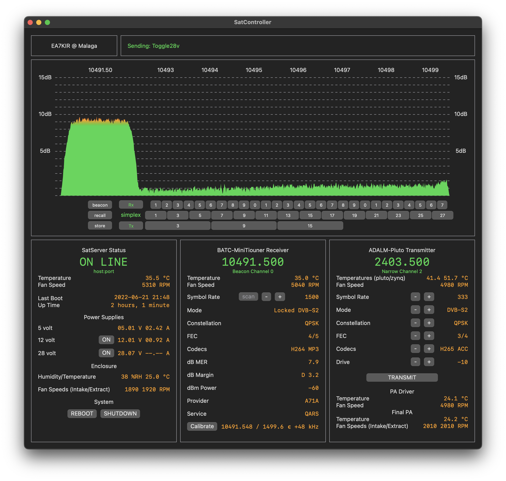

# SatController

## Description

SatController, together with [SatServer](https://github.com/ea7kir/SatServer) and [SatReceiver](https://github.com/ea7kir/SatReceiver), is a system for controlling and monitoring Digital Amateur Television (DATV) equipment over a wired local area network.

## Platform

- Apple iMac
- macOS 12 (Monterey)
- Swift 5.6 (included with Xcode)

## Implementation

SatController, SatServer and SatReceiver are written in Swift, with Swift-NIO for the networking.  The server and receiver run as a service on the latest 64-bit version of Raspberry Pi OS Lite.  The controller is a desktop application with a SwiftUI user interface on an Apple iMac.  Transmitted audio & video is sourced internally from the Mac version of OBS. Received audio & video can be monitored with VNC on the iMac or an Apple TV and HDMI television. All other equipment (transmitter, power amplifier, receiver, power supplies, peripherals and ancillaries) are situated outdoors - weather protected and close to the antennas.

## Supported Devices

- Power Supplies
- Cooling Fans
- Various Sensors
- ADALM-Pluto Transmitter
- RF Power Amplifier
- BATC-MiniTiouner Receiver
- Etc, etc.

## Current Status

**THIS IS WORK IN PROGRESS, SO SOME FUNCTIONALITY MAY BE MISSING**

## Acknowledgements

- Members of the BATC [batc.org.uk](https://batc.org.uk)
- Members of AMSAT-DL [amsat-dl.org](https://amsat-dl.org/en/)
- Swift Community [swift.org](https://swift.org)

## License

Copyright (C) 2021 Michael Naylor EA7KIR https://michaelnaylor.es

SatController is free software: you can redistribute it and/or modify
it under the terms of the GNU General Public License as published by
the Free Software Foundation, either version 3 of the License, or
(at your option) any later version.

SatController is distributed in the hope that it will be useful,
but WITHOUT ANY WARRANTY; without even the implied warranty of
MERCHANTABILITY or FITNESS FOR A PARTICULAR PURPOSE.  See the
GNU General Public License for more details.

You should have received a copy of the GNU General Public License
along with SatController.  If not, see <https://www.gnu.org/licenses/>.
